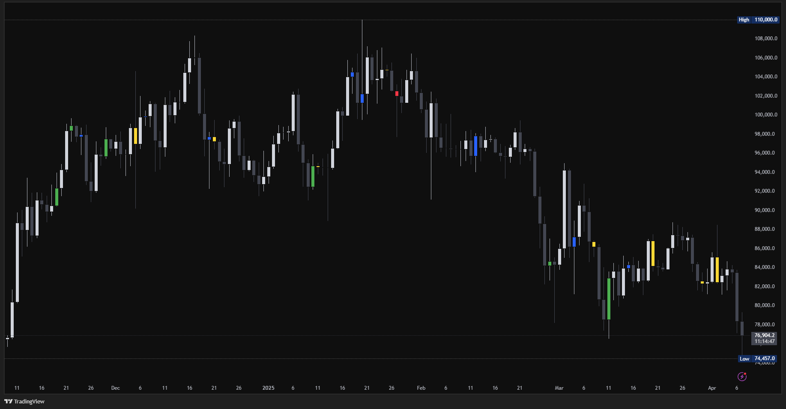

# Footprint Trigger Indicator

A custom TradingView Pine Script indicator designed to identify **trapped buyers and sellers** using **Open Interest** and **Cumulative Volume Delta (CVD)**. It adjusts timeframes automatically based on the current chart.

---

## 🔍 Features

- ✅ Detects potential market reversals by analyzing aggressive volume (CVD) and Open Interest behavior.
- 🧠 **Auto-adjusting timeframes** (no need for manual input).
- 🎨 Color-coded candles:
  - 🔴 Red – Buyers trapped while OI increases
  - 🟢 Green – Sellers trapped while OI increases
  - 🟡 Yellow – Buyers trapped
  - 🔵 Blue – Sellers trapped

---

## 🧠 How It Works

The indicator combines two key concepts:

1. **Open Interest Delta**: 
   - Compares current and previous OI values to determine if positions are increasing or decreasing.
   
2. **Cumulative Volume Delta (CVD)**:
   - CVD shows the difference between aggressive buy volume and aggressive sell volume over a specific period.

---

## 📥 How to Use

1. Copy the full script from [`trigger-script.pine`](./trigger-script.pine).
2. Open TradingView → Pine Editor.
3. Paste the script and click “Add to chart”.

---

## 📸 Example Setup

Try using the indicator on BTCUSDT.P (Binance Perpetual) with a 15-minute chart. The candle colors will change based on buy and sell pressure in the market.

---

## ⚠️ Note

This indicator is a tool to highlight potential trapped traders based on Open Interest and CVD dynamics.  
However, false signals may occur, especially in ranging or low-volume conditions.  
Understanding market context and combining this with other tools or experience is highly recommended.

---

## 📄 License

Licensed under the [Mozilla Public License 2.0](https://www.mozilla.org/MPL/2.0/)

